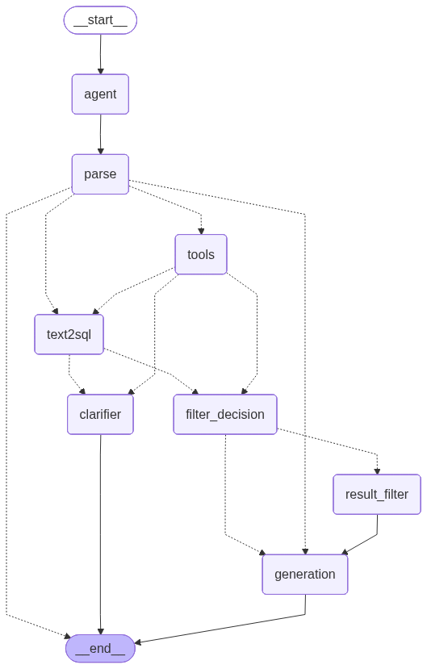

# Fin Agent

**LangGraph 기반 지능형 주식 정보 검색 AI 에이전트**

자연어 질문을 이해하고 16개의 전문 도구와 TEXT2SQL을 활용하여 포괄적인 주식 정보를 제공하는 정교한 금융 분석 시스템입니다.

## 시스템 워크플로우



## 핵심 효율화 전략

| 전략 | 문제 해결 | 구현 방법 |
|------|-----------|-----------|
| **기본 Tool + TEXT2SQL** | 정확성 vs 속도 | 미리 정의된 Tool 우선 → 복잡한 계산만 TEXT2SQL |
| **Clarifier 노드** | 파라미터 부족 오류 | 에러 패턴 자동 감지 → 사용자 재질문 |
| **Result Filter 노드** | 토큰 제한 초과 | 대량 결과 사전 차단 → generation_node 보호 |
| **2단계 LLM 모델** | 비용 최적화 | HCX-007(중요작업) + HCX-005(단순작업) |

**상세 구현 내용**: [Stock Search Agent 노드별 분석](./README_STOCK_SEARCH_AGENT.md)

## API 요청 방법

### 서버 정보
- **서버 주소**: `http://211.188.48.167:8000`

### 주식 정보 검색

#### POST 방식 (권장)
```bash
curl -X POST "http://211.188.48.167:8000/search" \
     -H "Content-Type: application/json" \
     -d '{"question": "삼성전자의 2024-11-06 종가는?"}'
```

#### GET 방식 (간편)  
```bash
curl "http://211.188.48.167:8000/search?question=삼성전자의 2024-11-06 종가는?"
```

#### Python requests 방식
```python
import requests

# POST 방식
data = {'question': '삼성전자 주가 알려줘'}
response = requests.post('http://211.188.48.167:8000/search', json=data)
result = response.json()
print(result['answer'])

# GET 방식
params = {'question': '삼성전자 주가 알려줘'}
response = requests.get('http://211.188.48.167:8000/search', params=params)
result = response.json()
print(result['answer'])
```

#### 응답 예시
```json
{
    "answer": "삼성전자(005930.KS)의 2024-11-06 종가는 58,400원입니다. 전일 대비 +0.86% 상승했습니다."
}
```

### 서버 상태 확인
```bash
curl "http://211.188.48.167:8000/health"
```

### 종목 매수/매도 분석 (Stock Analyzer)

#### curl 방식
```bash
curl -X POST "http://211.188.48.167:8000/analyze" \
     -H "Content-Type: application/json" \
     -d '{"stock_name": "삼성전자", "news_count": 10}'
```

#### Python requests 방식
```python
import requests

# 종목 분석 요청
data = {"stock_name": "삼성전자", "news_count": 10}
response = requests.post("http://211.188.48.167:8000/analyze", json=data)
result = response.json()
print(result['analysis_result'])
```

#### 응답 예시
```json
{
  "stock_name": "삼성전자",
  "analysis_result": "## 📊 삼성전자 투자 분석\n\n### 뉴스 감성 분석\n1. 반도체 실적 호조 → 감성: 긍정, 영향: 상승요인\n2. 메모리 반등 기대 → 감성: 긍정, 영향: 상승요인\n\n### 💡 투자 판단\n- **전체 감성**: 긍정 우세\n- **추천 액션**: **매수**\n- **신뢰도**: ⭐⭐⭐⭐⭐\n\n### 🎯 결론\n최근 뉴스 기반으로 긍정적 전망, 단기 매수 추천",
  "news_count": 8,
  "status": "success",
  "timestamp": "2025-01-31T15:30:00"
}
```

## 시스템 아키텍처

**워크플로우 노드 구성**:
- **agent**: 질문 분석 & 도구 선택
- **parse**: TOOL_CALL 파싱
- **tools**: 기본 도구 실행
- **text2sql**: 복잡한 계산용 SQL 생성
- **clarifier**: 파라미터 부족 시 재질문
- **filter_decision**: 결과 필터링 여부 결정
- **result_filter**: 대량 결과 제한
- **generation**: 최종 응답 생성

## 전문 도구 (16개)

### 기본 정보 조회
- **get_stock_price**: 개별 종목 주가 정보
- **get_market_stats**: 시장 전체 통계
- **get_market_index**: KOSPI/KOSDAQ 지수
- **search_company**: 회사명으로 종목 검색

### 조건별 검색
- **search_price**: 가격 기준 검색 (순위/범위)
- **search_price_change**: 등락률 기준 검색
- **search_volume**: 거래량 기준 검색
- **search_trading_value_ranking**: 거래대금 순위

### 기술분석
- **get_rsi_signals**: RSI 과매수/과매도
- **get_bollinger_signals**: 볼린저 밴드 터치
- **get_ma_breakout**: 이동평균 돌파
- **get_volume_surge**: 거래량 급증 (20일 평균 대비)
- **get_cross_signals**: 골든크로스/데드크로스 목록
- **count_cross_signals**: 크로스 신호 횟수

### 고급 분석
- **search_compound**: 복합조건 검색
- **TEXT2SQL**: 동적 SQL 생성 (전날대비 비교, 비율 계산 등)

## 데이터베이스 구조

### 데이터베이스 연결
```
├── stock_info.db (주가 정보)
│   └── stock_prices 테이블
├── market_index.db (시장 지수)
│   └── market_index 테이블  
├── technical_indicators.db (기술지표)
│   └── technical_indicators 테이블
└── company_info.csv (기업 정보)
```

### 주요 테이블 스키마
```sql
-- stock_prices
├── ticker (종목코드)
├── stock_name (종목명)
├── trading_date (거래날짜)
├── open_price, high_price, low_price, close_price
├── trading_volume (거래량)
├── change_rate (등락률)
└── market (KOSPI/KOSDAQ)

-- technical_indicators  
├── ticker, trading_date
├── rsi, ma5, ma20, ma60, ma120
├── bb_upper, bb_middle, bb_lower
├── volume_ratio (20일 평균 대비)
├── golden_cross, dead_cross
└── macd, macd_signal, macd_histogram
```


## 질문 예시

### 기본 조회
```bash
curl "http://211.188.48.167:8000/search?question=삼성전자의 2024-11-06 종가는?"
curl "http://211.188.48.167:8000/search?question=2024-11-06 KOSPI 지수는?"
```

### 순위 조회
```bash
curl "http://211.188.48.167:8000/search?question=2024-11-06 상승률 상위 10개 종목은?"
```

### 기술분석
```bash
curl "http://211.188.48.167:8000/search?question=2024-11-06에 RSI가 70 이상인 과매수 종목을 알려줘"
```

### 복합조건
```bash
curl "http://211.188.48.167:8000/search?question=2024-11-06에 등락률이 +3% 이상이면서 거래량이 100만주 이상인 종목은?"
```

## 설정

### LLM 모델 구성
- **llm_main (HCX-007)**: 쿼리 분석, 도구 선택, TEXT2SQL 생성
- **llm_simple (HCX-005)**: 최종 응답 생성, 파라미터 추출

---

**Fin Agent**는 LangGraph 기반의 지능적인 워크플로우를 통해 복잡한 주식 관련 질의응답을 효과적으로 처리하는 차세대 금융 AI 시스템입니다.